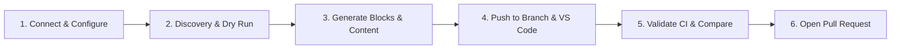

# AEM → EDS Experience Modernizer

[](https://github.com/Shaik-Tajuddin/AEM-EDS-Modernizer)
[](https://www.oracle.com/java/)
[](https://experienceleague.adobe.com/)
[](https://www.aem.live/)
[](LICENSE)

> **Enterprise-grade, autonomous platform deployed inside Adobe Experience Manager (AEM) to assess, plan, migrate, validate, self-repair, and publish web experiences to Adobe Edge Delivery Services (EDS).**

---

## 📖 Table of Contents

- [Overview & Mission](#-overview--mission)
- [End-to-End Migration Flow](#-end-to-end-migration-flow-step-by-step)
- [Key Features & Capabilities](#-key-features--capabilities)
  - [1. VS Code Web Workspace & Diff Viewer](#1-vs-code-web-workspace--diff-viewer)
  - [2. Local Dev Server (`aem up`) & Authored Page Comparison](#2-local-dev-server-aem-up--authored-page-comparison)
  - [3. Pre-PR Healing & CI Validation (GitHub Actions)](#3-pre-pr-healing--ci-validation-github-actions)
  - [4. Automated Pull Request & Live Preview Links](#4-automated-pull-request--live-preview-links)
  - [5. Component Block Quad & Content Parity System](#5-component-block-quad--content-parity-system)
- [Architecture & Multi-Module Layout](#-architecture--multi-module-layout)
- [The 25 Modernizer Agents](#-the-25-modernizer-agents)
- [Getting Started](#-getting-started)
  - [Prerequisites](#prerequisites)
  - [1. Deploying to AEM Author (Local / Cloud)](#1-deploying-to-aem-author-local--cloud)
  - [2. Running as Standalone Server (Offline / CI)](#2-running-as-standalone-server-offline--ci)
- [Targeted Maven Deployment Guide](#-targeted-maven-deployment-guide)
- [REST API Reference](#-rest-api-reference)
- [Testing & Validation](#-testing--validation)
- [Documentation Index](#-documentation-index)

---

## 🎯 Overview & Mission

Migrating enterprise content and components from traditional AEM (HTL, WCM Core Components, Dialogs, ClientLibs) to Adobe Edge Delivery Services (EDS Markdown section models, Vanilla JS/CSS blocks) requires rigorous planning, structural transformation, code quality enforcement, and visual fidelity.

The **AEM → EDS Experience Modernizer** provides an explainable, safe, measurable, and enterprise-ready control plane with two runtime modes:

1. **Inside AEM as a Cloud Service / 6.5+**: As an OSGi bundle and Content Package accessible at `/content/aem-eds-modernizer/home.html` and `/bin/aem-eds-modernizer/dashboard`.
2. **Standalone Executable**: As a self-contained shaded fat JAR with an embedded HTTP server on port `8080` for CI/CD pipelines and local experimentation.

---

## 🚀 End-to-End Migration Flow (Step-by-Step)

Follow this 6-step workflow to modernize any AEM site or component subtree:



### **Step 1: Connect & Configure Scope**

1. Open the Modernizer Dashboard (`http://localhost:4502/bin/aem-eds-modernizer/dashboard`).
2. Navigate to **⚙️ Project Configuration**:
   - **Project ID & Name**: e.g., `wknd-site-aboutus`
   - **AEM Environment**: Enter Author URL (e.g. `http://localhost:4502`) and Content Root Path (e.g. `/content/wknd/us/en/about-us`).
   - **Target EDS Git Repo**: e.g. `https://github.com/shaik-tajuddin/wknd-eds`
   - **AI Provider**: Choose between Anthropic (`Claude 3.5 Sonnet`), OpenAI (`GPT-4o`), Google Gemini, Ollama (Local), or Mock.
3. Click **Save Configuration**.

---

### **Step 2: Run Discovery & Dry Run**

1. Click **🔍 Run Dry Run** in the top action bar.
2. The orchestrator crawls the AEM JCR content tree, extracts component dialog models, and calculates:
   - Total eligible pages & unique components.
   - Derivation trail with expected tokens, estimated AI cost, and execution duration.
3. Review the **Overview**, **Components**, and **Pages & Scope** tabs.

---

### **Step 3: Generate & Build Blocks**

1. Click **⚡ Generate & Build Blocks**.
2. Autonomous agents synthesize the complete **Block Quad** for each discovered component:
   - `blocks/<name>/<name>.js` (DOM decoration logic)
   - `blocks/<name>/<name>.css` (Scoped CSS styling)
   - `blocks/<name>/_<name>.json` (Universal Editor / Component definition models)
   - `blocks/<name>/<name>-example.html` & `README.md`
   - DA Markdown table renditions for all migrated pages.

---

### **Step 4: Push to Feature Branch & Review in VS Code**

1. Navigate to the **VS Code & GitHub** tab.
2. In the **Remote Branch & VS Code Editor Workspace** card:
   - Confirm the feature branch name (e.g. `feat/wknd-site-aboutus`).
   - Click **🚀 Push Blocks & Open VS Code**.
3. Modernizer performs pre-PR healing locally (checkout → deduplication → linting → commit) and pushes to your remote Git branch.
4. Expand the **⚡ VS Code Web Workspace** panel:
   - View all modified and added files with real-time Git diff markers (+green additions / -red deletions).
   - Edit code directly in the browser or click **🔗 Open in New Tab** to launch `vscode.dev`.

---

### **Step 5: Run CI Validation & Authored Page Comparison**

1. In the **npm scripts (GitHub Actions)** card:
   - Click **`npm run lint:fix`** to trigger remote linting workflows.
   - Click **`npm run build:json`** to compile Universal Editor definitions.
   - If any build fails, click **`Heal CI`** to allow AI agents to auto-patch errors.
2. In the **Local Dev Server & Authored Page Comparison** card:
   - Click **`▶ Start aem up`** to run the local Helix dev server.
   - Enter your authored preview URL (e.g. `http://localhost:3000/about-us` or `.aem.page` preview URL).
   - Click **`🤖 Compare with AEM`** to compare visual and DOM structures against the Reference Rootpath (`http://localhost:4502/content/wknd/us/en/about-us.html`).

---

### **Step 6: Confirm Review & Open Pull Request**

1. In the **Confirm Review & Open Pull Request** card:
   - Check the confirmation box: `☑ I have reviewed this branch in VS Code. Enable Create PR...`.
   - Click **`📤 Open Pull Request`**.
2. Modernizer creates an official GitHub Pull Request containing:
   - Summary of migrated blocks and pages.
   - Live AEM Edge Delivery testing URL:

     ```markdown
     Automated migration generated by AEM → EDS Modernizer.

     URL for testing:

     - https://feat-wknd-site-aboutus--wknd-eds--shaik-tajuddin.aem.page/
     ```

---

## ⚡ Key Features & Capabilities

### 1. VS Code Web Workspace & Diff Viewer

- **Zero CLI Setup**: Edit remote branch files directly within the AEM dashboard using an embedded Monaco-like editor.
- **Smart Diff Annotations**: Real-time line-by-line diff view showing exact insertions and deletions.
- **Collapsible & Resizable**: Drag to resize the sidebar and editor panels; click the header accordion arrow (`▼` / `▶`) to minimize or expand.

### 2. Local Dev Server (`aem up`) & Authored Page Comparison

- **Live Local Preview**: Start, stop, and check the status of the local Adobe AEM CLI dev server on port `3000`.
- **Dynamic Reference Rootpath**: Automatically constructs the source AEM URL (`AEM Author URL + Content Root Path + .html`) for side-by-side DOM and visual matching.
- **AI Page Matching Agent**: Analyzes differences between AEM HTL renders and EDS JavaScript block outputs, suggesting exact CSS class and DOM fixes.

### 3. Pre-PR Healing & CI Validation (GitHub Actions)

- **Pre-PR Healing Loop**: Automatically checks out the branch, prunes duplicate blocks (e.g. avoiding overwriting default boilerplate blocks like `title` and `text`), runs `npm run lint:fix`, and compiles `component-models.json`.
- **Remote Dispatch**: Dispatches and streams live GitHub Actions workflow logs directly into the `#npm-log-terminal`.
- **Autonomous Heal CI**: Catches CI failures, sends error logs to the AI provider, generates patches, and commits fixes automatically.

### 4. Automated Pull Request & Live Preview Links

- **Sanitized Branch Testing URLs**: Automatically transforms branch names with slashes (e.g. `feat/wknd-site-aboutus` → `feat-wknd-site-aboutus`) and builds canonical `.aem.page` live preview URLs.
- **Protected Gate**: Prevents accidental PR creation until pre-PR validation has completed and the developer explicitly checks the review confirmation.

### 5. Component Block Quad & Content Parity System

- **100% Real JCR Content**: Extracts actual properties from `_jcr_content.infinity.json` rather than hardcoded mock stubs.
- **Full Block Quad**: Every generated block includes JavaScript DOM decoration, CSS styling, Universal Editor definitions (`_block.json`), example HTML, and markdown documentation.

---

## 🏗 Architecture & Multi-Module Layout

The project follows the standard Adobe Cloud Manager Maven reactor structure:

```
AEM-EDS-Modernizer/
├── pom.xml                                      # Parent reactor POM (Java 11/17)
├── core/                                        # OSGi bundle + shaded standalone executable fat JAR
│   └── src/main/java/com/adobe/aem/modernizer/
│       ├── agents/                              # 25 Autonomous agents & Orchestrator state machine
│       ├── ai/                                  # Multi-provider AI Gateway (OpenAI, Anthropic, Gemini, Ollama, Mock)
│       ├── connectors/                          # AEM, EDS, GitHub, LocalEdsRepoManager, Figma connectors
│       ├── dashboard/                           # StaticDashboard & API Router
│       ├── mock/                                # Deterministic mock fixtures & test factories
│       ├── persistence/                         # In-memory & JCR persistence stores (CRX /var visible)
│       ├── scopes/                              # Marker-based page & component eligibility evaluators
│       ├── security/                            # RBAC, audit logger & secret redactor
│       └── services/                            # Estimator, Redirects, DependencyGraph, Benchmarks
├── ui.apps/                                     # AEM HTL components, ClientLibs, and dashboard UI
├── ui.config/                                   # OSGi configurations & RepoInit system user setup
├── ui.content/                                  # Seed JCR content packages
├── all/                                         # Adobe Cloud Manager container package (.zip)
└── docs/                                        # Architecture Decision Records (ADR) & guides
```

---

## 🤖 The 25 Modernizer Agents

| #   | Agent Name                       | Phase | Stage              | Description                                                              |
| --- | -------------------------------- | ----- | ------------------ | ------------------------------------------------------------------------ |
| 1   | `ConnectionAgent`                | 1     | `CONNECTING`       | Validates reachability to AEM, EDS, GitHub, Figma, and Local Dev Server. |
| 2   | `DiscoveryAgent`                 | 1     | `DISCOVERING`      | Crawls AEM page trees and builds the immutable `SiteInventory` snapshot. |
| 3   | `ComponentIntelligenceAgent`     | 1     | `ANALYZING`        | Classifies component dialogs, HTML models, and capability requirements.  |
| 4   | `ComponentMappingAgent`          | 1     | `ANALYZING`        | Maps AEM resource types to EDS block definitions.                        |
| 5   | `TemplateAnalysisAgent`          | 1     | `ANALYZING`        | Analyzes editable templates and section layouts.                         |
| 6   | `ContentAnalysisAgent`           | 1     | `ANALYZING`        | Evaluates semantic tree depth, typography density, and formatting.       |
| 7   | `AssetAnalysisAgent`             | 1     | `ANALYZING`        | Inspects DAM references as metadata-only (zero binary downloads).        |
| 8   | `ContentFragmentAnalysisAgent`   | 1     | `ANALYZING`        | Maps structured Content Fragments to EDS JSON data tables.               |
| 9   | `MsmAnalysisAgent`               | 1     | `ANALYZING`        | Maps MSM live copies and language masters to EDS localization.           |
| 10  | `FigmaAnalysisAgent`             | 1     | `DESIGN_ANALYSIS`  | Extracts color palettes, typography, and spacing tokens from Figma.      |
| 11  | `AdvancedFigmaIntelligenceAgent` | 2     | `DESIGN_ANALYSIS`  | Deep component-to-block pairing and CSS custom property token maps.      |
| 12  | `MigrationPlannerAgent`          | 1     | `PLANNING`         | Generates the Migration Plan, derivation trail, and cost/time bounds.    |
| 13  | `BlockGenerationAgent`           | 1     | `BUILDING`         | Synthesizes the full Block Quad from real JCR component properties.      |
| 14  | `CodeGenerationAgent`            | 1     | `BUILDING`         | Generates CSS stylesheets, global styles, and `fstab.yaml` mounts.       |
| 15  | `ContentMigrationAgent`          | 1     | `MIGRATING`        | Converts AEM content trees into EDS Markdown section models.             |
| 16  | `AuthoringAgent`                 | 1     | `AUTHORING`        | Sets up Universal Editor and Document-Based authoring contracts.         |
| 17  | `PreviewAgent`                   | 1     | `PREVIEWING`       | Pushes commits to GitHub preview branch and activates EDS preview.       |
| 18  | `ValidationAgent`                | 1     | `VALIDATING`       | Deterministic functional validation (broken links, SEO, a11y, schema).   |
| 19  | `VisualValidationAgent`          | 1     | `VALIDATING`       | Baseline visual regression checks against reference renders.             |
| 20  | `AdvancedVisualValidationAgent`  | 2     | `VALIDATING`       | Representative template sampling and pure-Java visual diff engine.       |
| 21  | `SelfRepairAgent`                | 1     | `REPAIRING`        | Basic automated repair for minor styling discrepancies.                  |
| 22  | `AdvancedRepairAgent`            | 2     | `REPAIRING`        | Bounded multi-attempt repair loop with patch diff synthesis.             |
| 23  | `AdvancedRolloutAgent`           | 2     | `READY_TO_PUBLISH` | Schedules 6-stage progressive traffic rollout with stop gates.           |
| 24  | `PublishingAgent`                | 1     | `PUBLISHING`       | Creates production GitHub Pull Requests with live `.aem.page` URLs.      |
| 25  | `VerificationAgent`              | 1     | `VERIFYING`        | Performs live post-publish crawl to verify 0 regressions.                |

---

## 💻 Getting Started

### Prerequisites

- **Java**: JDK 11 or JDK 17
- **Maven**: Apache Maven 3.9+
- **AEM**: Local AEM Quickstart (6.5+ or SDK on `http://localhost:4502`) or Adobe Cloud Manager.

---

### 1. Deploying to AEM Author (Local / Cloud)

```bash
# Clone the repository
git clone https://github.com/Shaik-Tajuddin/AEM-EDS-Modernizer.git
cd AEM-EDS-Modernizer

# Deploy full reactor to local AEM Author (port 4502)
mvn clean install -Pdeploy -DskipTests
```

Open your browser to:

- **Modernizer Dashboard**: `http://localhost:4502/bin/aem-eds-modernizer/dashboard`
- **Modernizer AEM Page**: `http://localhost:4502/content/aem-eds-modernizer/home.html`

---

### 2. Running as Standalone Server (Offline / CI)

```bash
# Build the standalone fat JAR
mvn clean package -pl core -DskipTests

# Launch server on port 8080
java -jar core/target/aem-eds-modernizer.core-0.1.0-SNAPSHOT-standalone.jar 8080
```

Access the UI at `http://localhost:8080`.

---

## ⚡ Targeted Maven Deployment Guide

For optimal development speed, avoid full reactor builds when making isolated changes. Use these targeted commands:

| Changed Scope                                  | Fast Targeted Command                                  |
| :--------------------------------------------- | :----------------------------------------------------- |
| **Java Core / Agents / Connectors / Servlets** | `mvn clean install -Pdeploy -pl core -DskipTests`      |
| **Dashboard UI / HTL / ClientLibs (CSS, JS)**  | `mvn clean install -Pdeploy -pl ui.apps -DskipTests`   |
| **OSGi Configurations & RepoInit**             | `mvn clean install -Pdeploy -pl ui.config -DskipTests` |
| **Multi-module changes (Core + UI)**           | `mvn install -Pdeploy -pl core,ui.apps -DskipTests`    |

---

## 📡 REST API Reference

All routes are served under `/bin/aem-eds-modernizer/api` (AEM Author) and `/api` (Standalone):

| Method | Endpoint                     | Description                                                          |
| :----- | :--------------------------- | :------------------------------------------------------------------- |
| `GET`  | `/projects`                  | List all migration projects.                                         |
| `POST` | `/projects`                  | Create or update a project configuration.                            |
| `POST` | `/projects/{id}/dryrun`      | Execute discovery and dry run pipeline.                              |
| `POST` | `/projects/{id}/migrate`     | Generate blocks, styles, and Markdown content.                       |
| `POST` | `/projects/{id}/preview`     | Push to preview branch and run local pre-PR healing.                 |
| `POST` | `/projects/{id}/publish`     | Create official production GitHub Pull Request.                      |
| `POST` | `/projects/{id}/compare`     | Execute AI page comparison between AEM and EDS.                      |
| `POST` | `/projects/{id}/npm`         | Dispatch GitHub Actions workflow (`lint:fix`, `build:json`, `heal`). |
| `GET`  | `/projects/{id}/npm/{runId}` | Stream live logs for a GitHub Actions workflow run.                  |
| `POST` | `/projects/{id}/aemup`       | Control local dev server (`start`, `stop`, `status`).                |

---

## 🧪 Testing & Validation

```bash
# Run unit test suite
mvn test

# Run end-to-end verification script
bash scripts/e2e.sh
```

---

## 📚 Documentation Index

Detailed architectural, security, and operational documentation is located in [`docs/`](docs/):

- 🏛 **Architecture Decision Records**: [`docs/adr/`](docs/adr/) (ADR 0001 - ADR 0015)
- ⚙️ **AEM Cloud & Dispatcher Setup**: [`docs/aem/`](docs/aem/)
- 🤖 **Agent Specifications**: [`docs/agents/`](docs/agents/)
- 📐 **EDS Pipelines & Conventions**: [`docs/eds/`](docs/eds/)
- 🎨 **Figma Token Extraction**: [`docs/figma/`](docs/figma/)
- 🐙 **GitHub Operations & PRs**: [`docs/github/`](docs/github/)
- 📊 **Migration Policies & Scope**: [`docs/migration/`](docs/migration/)
- 🛡 **Security, SSRF & RBAC**: [`docs/security/`](docs/security/)

---

## 📄 License

This project is licensed under the Apache License 2.0. See the [LICENSE](LICENSE) file for details.
