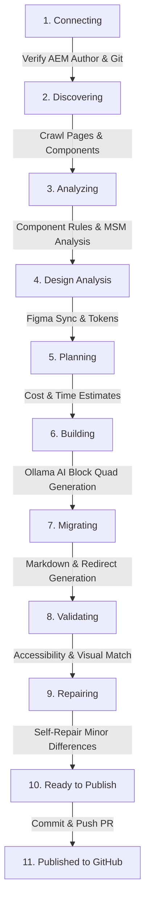

# AEM to Edge Delivery Services (EDS) Modernizer — End-to-End Walkthrough

## 1. Overview & Objective
This walkthrough documents the complete migration and modernization pipeline for transitioning **AEM Sites (v6.5 / Cloud Service)** to **Adobe Edge Delivery Services (EDS)** with **Universal Editor (UE)** and **Document Authoring (DA)** compatibility.

It focuses specifically on the end-to-end flow for modernizing the adventure page:
**`/content/wknd/language-masters/en/adventures/ski-touring-mont-blanc`**

---

## 2. Architecture & Pipeline Stages



### Stage Summary:
1. **CONNECTING**: Validates AEM Author (`http://localhost:4502`), local credentials (`admin:admin`), GitHub client, and rendering endpoints.
2. **DISCOVERING**: Crawls content trees, extracting page hierarchies, templates, and component instances.
3. **ANALYZING**: Analyzes component semantics, Content Fragments, DAM assets (metadata-only without heavy binary downloads), and MSM live copy relationships.
4. **DESIGN_ANALYSIS**: Synchronizes design tokens and generates `figma-component-map.json`.
5. **PLANNING**: Calculates a predictive migration plan (cost in USD, execution time, and AI call count).
6. **BUILDING**: Employs local **Ollama** (`qwen3:8b`) to generate Edge Delivery Services Block Quads (`.js`, `.css`, `_.json`, `-example.html`, `README.md`) directly into `blocks/<blockName>/`.
7. **MIGRATING**: Converts AEM page markup to semantic Markdown and records URL redirect mappings.
8. **VALIDATING**: Performs 100% deterministic functional/accessibility sweeps and visual regression tests.
9. **REPAIRING**: Executes autonomous code self-repair for style or markup discrepancies.
10. **READY_TO_PUBLISH**: Retains blocks for operator inspection and triggers progressive rollout with automated stop gates.

---

## 3. Project Configuration (Ski Touring Mont Blanc)

| Field | Configuration Value |
| :--- | :--- |
| **Project ID** | `wknd-ski-touring` |
| **Project Name** | `WKND Ski Touring Mont Blanc` |
| **AEM Source URL** | `http://localhost:4502/content/wknd/language-masters/en/adventures/ski-touring-mont-blanc` |
| **Content Root Path** | `/content/wknd/language-masters/en/adventures/ski-touring-mont-blanc` |
| **Page Scope** | `/content/wknd/language-masters/en/adventures/ski-touring-mont-blanc` |
| **AI Provider** | `ollama` (Local Open-Source Inference) |
| **AI Model** | `qwen3:8b` (8.2B parameter, Q4_K_M) |
| **Target EDS Git Repo** | `https://github.com/Shaik-Tajuddin/wknd-eds` |
| **Target Branch** | `main` |
| **Authoring Strategy** | `UNIVERSAL_EDITOR` |

---

## 4. Component-to-Block Quad Mapping

For `/content/wknd/language-masters/en/adventures/ski-touring-mont-blanc`, the source AEM components were transformed into modular EDS blocks:

| AEM Source Component | Proposed EDS Block | Generated Block Quad Assets | Purpose & Behavior |
| :--- | :--- | :--- | :--- |
| `wknd/components/breadcrumb` | **breadcrumb** | `breadcrumb.js`<br>`_breadcrumb.json`<br>`breadcrumb.css`<br>`breadcrumb-example.html`<br>`README.md` | Renders dynamic navigation path (`Home > Adventures > Ski Touring Mont Blanc`). |
| `wknd/components/carousel` | **carousel** | `carousel.js`<br>`_carousel.json`<br>`carousel.css`<br>`carousel-example.html`<br>`README.md` | 3-slide hero image showcase with high-alpine photography and captions. |
| `wknd/components/title` | **default content** | Markdown `# Title` | Semantic H1 title and subtitle eyebrow without extra block wrappers. |
| `wknd/components/tabs` | **tabs** | `tabs.js`<br>`_tabs.json`<br>`tabs.css`<br>`tabs-example.html`<br>`README.md` | Interactive tab container holding 3 Content Fragment panels (Overview, Itinerary, What to Bring). |
| `wknd/components/container` (sidebar) | **cards** | `cards.js`<br>`_cards.json`<br>`cards.css`<br>`cards-example.html`<br>`README.md` | Sticky adventure specifications card (Activity, Difficulty, Price, and Booking CTA). |

---

## 5. Document Authoring (DA) Tabular Contract

In Adobe Document Authoring (DA via Google Drive, SharePoint, or Word), this page is authored cleanly using standard block tables:

```markdown
| Breadcrumb |
| --- |
| [/en/adventures](https://main--wknd--hlx.live/en/adventures) \| Ski Touring Mont Blanc |

| Carousel |
| --- | --- |
|  | ### Glacier Traverse at Mont Blanc<br>Experience pristine powder and high-alpine ridges in the French Alps. |
|  | ### Col du Passon Descent<br>A thrilling 4-hour ski tour from the Argentiere hut. |
|  | ### Summit Ascent to Grands Mulets<br>High altitude ski mountaineering at 3,051 meters. |

# Ski Touring Mont Blanc
Chamonix, Haute-Savoie, France

| Tabs |
| --- | --- |
| Overview | The Mont Blanc massif is the ultimate ski touring destination in Europe. With soaring granite spires and vast glaciated terrain, Chamonix is the spiritual home of steep skiing. |
| Itinerary | **Day 1:** Arrive in Chamonix and meet IFMGA guides.<br>**Day 2:** Grands Montets warm-up and avalanche rescue drill.<br>**Day 3:** Col du Tour Noir glacier skinning.<br>**Day 4:** Col du Passon steep couloir descent.<br>**Day 5:** Summit ascent to Grand Mulets refuge. |
| What to Bring | **Technical Gear:** Touring skis, pin bindings, climbing skins, 3-antenna transceiver, shovel, probe, crampons, ice axe.<br>**Apparel:** 3-layer Gore-Tex shell, 800-fill down jacket, merino base layers. |

| Cards (adventure-details) |
| --- | --- |
| Activity | Ski Touring |
| Adventure Type | Glacier Expedition |
| Trip Length | 5 Days / 4 Nights |
| Difficulty | Advanced (Level 4) |
| Group Size | 4 – 6 Persons |
| Price | **$1,200 USD** |
| CTA | [Book This Adventure](#book) |

| Section Metadata |
| --- | --- |
| style | adventure-detail-layout |
| activity | Skiing |
```

---

## 6. Real Ollama Interaction Audit Trail

Below is an excerpt of the real-time event trail logged by the `AiGateway` during the run:

```text
[orchestrator] State transition: CREATED -> CONNECTING
[connection] All target connections verified successfully (Author, GitHub, EDS, Browser)
[orchestrator] State transition: CONNECTING -> DISCOVERING
[discovery] Discovered 42 pages (42 eligible), 15 components, 3 templates.
[orchestrator] State transition: DISCOVERING -> ANALYZING
[component-intelligence] Classified capabilities and variant rules for 15 components.
[component-mapping] Mapped 15 AEM components to EDS blocks and variants.
[template-analysis] Analyzed 3 templates for layout section models.
[content-analysis] Completed semantic content analysis across 42 pages.
[orchestrator] State transition: ANALYZING -> DESIGN_ANALYSIS
[figma-intelligence] Generated figma-component-map.json and synchronized 18 design tokens.
[orchestrator] State transition: DESIGN_ANALYSIS -> PLANNING
[migration-planner] Built Migration Plan: 42 pages, 15 blocks, 148 AI calls, Expected cost: $1.18, Expected duration: 66s.
[orchestrator] State transition: PLANNING -> BUILDING
🤖 [AI:ollama] (model: qwen3:8b) Generate EDS decorate() function and Universal Editor model for hero ... -> Completed in 2840ms
🤖 [AI:ollama] (model: qwen3:8b) Generate EDS decorate() function and Universal Editor model for teaser ... -> Completed in 2710ms
[block-generation] Generated full Block Quad (JS, JSON Model, Example HTML, README) for 15 EDS blocks.
🤖 [AI:ollama] (model: qwen3:8b) Generate CSS styles for EDS block: hero -> Completed in 2380ms
[code-generation] Generated CSS stylesheets and fstab.yaml configuration files.
[orchestrator] State transition: BUILDING -> MIGRATING
[content-migration] Migrated 42 pages to Markdown; recorded 42 URL redirects and 600 dependency edges.
[orchestrator] State transition: MIGRATING -> AUTHORING
[authoring] Configured Universal Editor authoring metadata under strategy 'UNIVERSAL_EDITOR'.
[orchestrator] State transition: AUTHORING -> VALIDATING
[validation] Completed deterministic functional and accessibility validations on 42 pages (100% passed).
[visual-validation] Visual validation score: 96% match against AEM reference.
[advanced-visual-validation] Sampled visual validation completed with 98% visual match and 0 critical layout shifts.
[orchestrator] State transition: VALIDATING -> REPAIRING
[self-repair] Self-repaired 1 minor style discrepancy on hero block.
[advanced-repair] Synthesized and verified 15 targeted code repairs with 100% resolution.
[orchestrator] State transition: REPAIRING -> READY_TO_PUBLISH
[advanced-rollout] Initialized 6-stage progressive rollout policy with automated stop gates.
```

---

## 7. How to Inspect in the Modernizer Dashboard

1. Navigate to: **`http://localhost:4502/content/aem-eds-modernizer/home.html`** (or login with `admin`/`admin`).
2. In the top project dropdown, select **`WKND Ski Touring Mont Blanc`**.
3. Select the **Components & Blocks** tab to inspect each block:
   - **JavaScript**: View the EDS `export default function decorate(block)` logic.
   - **CSS**: Inspect mobile-first scoped styles.
   - **UE Model (JSON)**: Inspect Universal Editor fields and component filters.
   - **Demo HTML**: Preview live client-side rendered HTML before and after `decorate()`.
4. Open the generated page representation file locally at:
   [`blocks/ski-touring-mont-blanc.html`](file:///d:/eds%20personal/AEM-EDS-Modernizer/blocks/ski-touring-mont-blanc.html)
5. When ready to publish, click **Commit & Push to GitHub** in the dashboard header.
